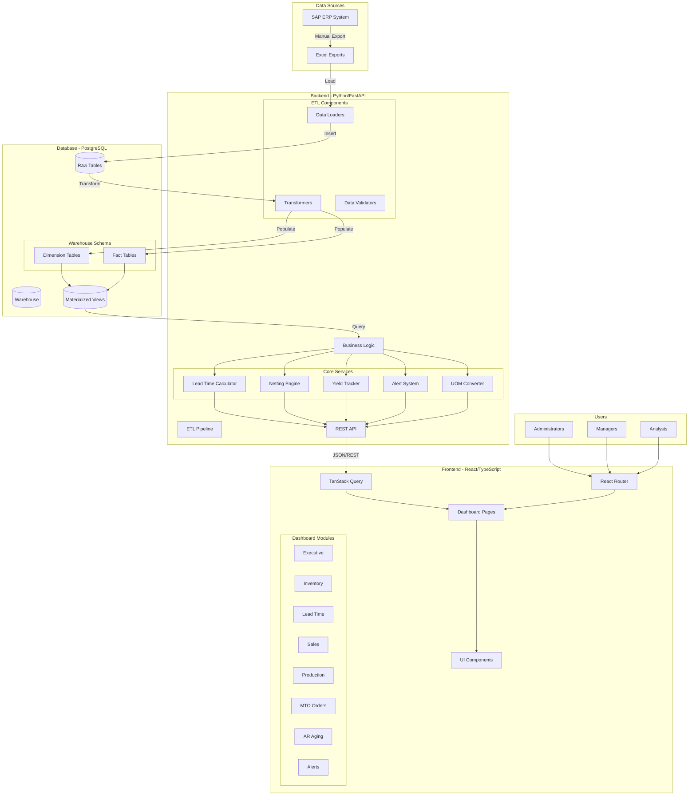
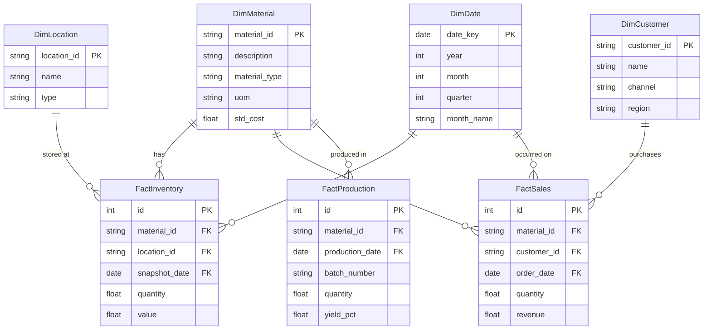
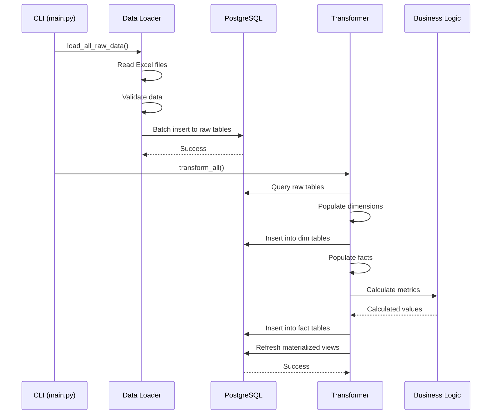
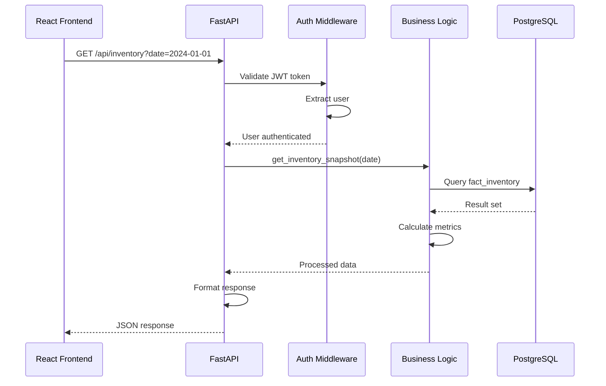
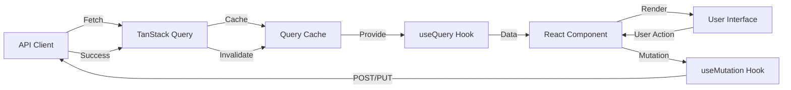
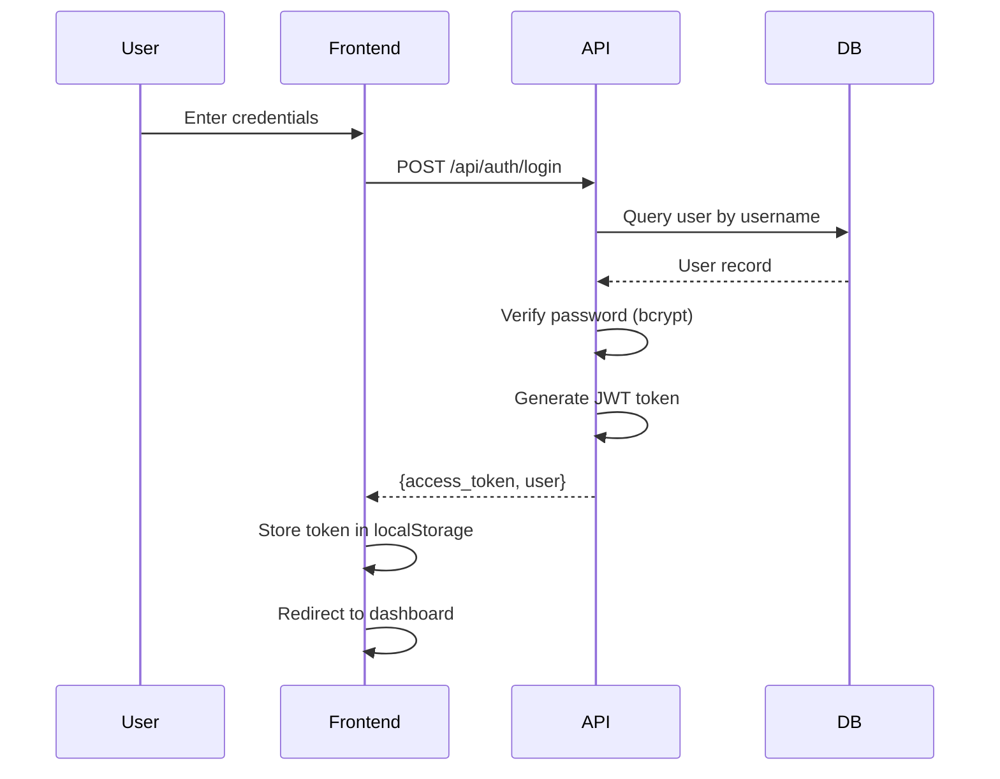
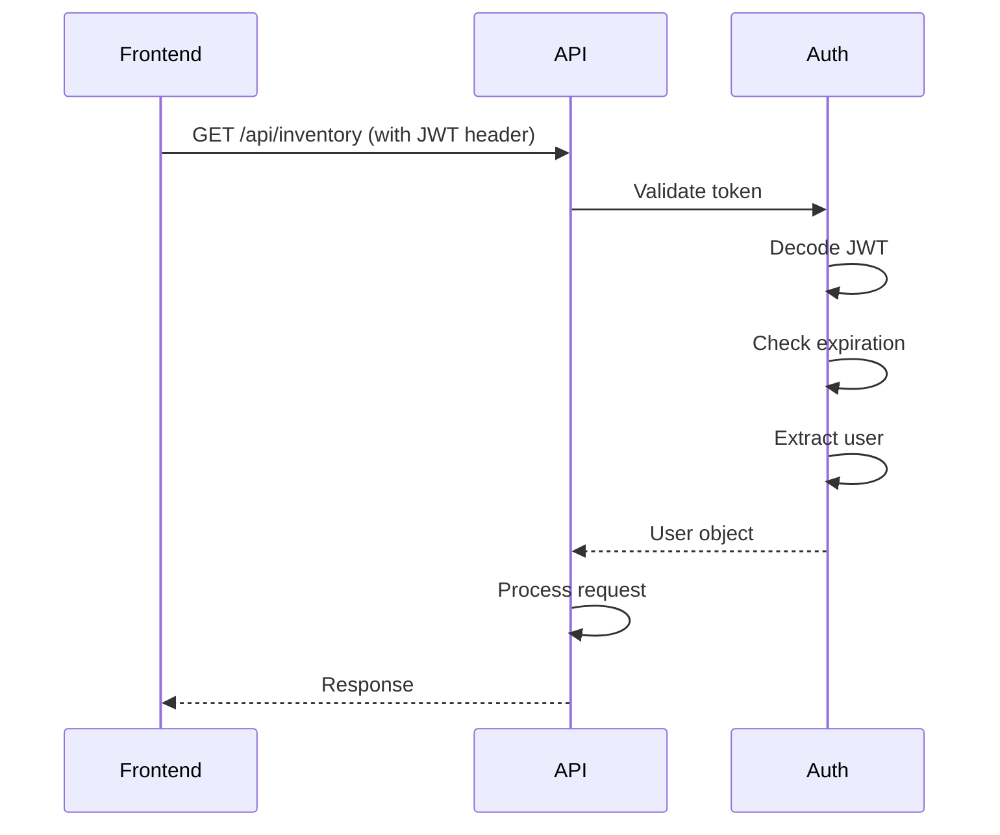
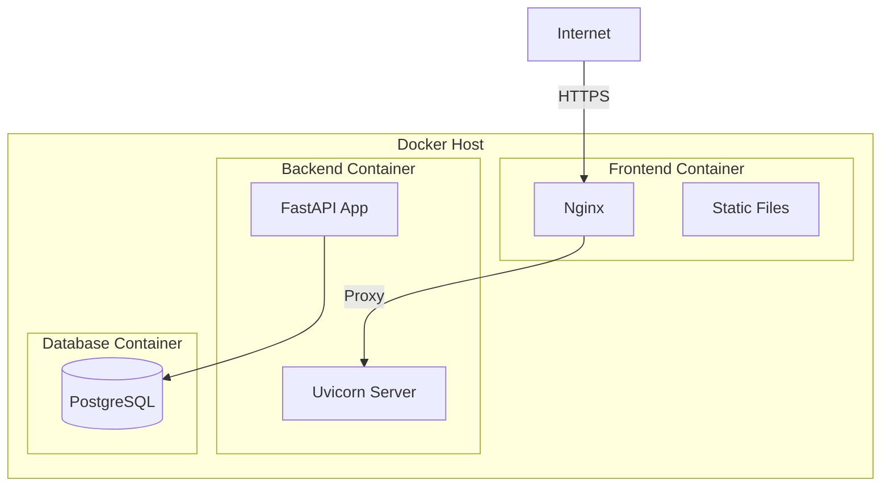

# Alkana Dashboard - System Architecture

## High-Level Architecture



## Architecture Layers

### 1. Data Layer

#### Data Sources
- **SAP ERP**: Source of truth for all business data
- **Excel Exports**: Manual exports from SAP (MB51, ZRSD002, ZRSD006, etc.)
- **File Storage**: `demodata/` directory for Excel files

#### Database Schema

**Raw Layer**
- Direct imports from Excel files
- Minimal transformation
- Preserves original data structure
- Tables: `raw_mb51`, `raw_zrsd002`, `raw_zrsd006`, etc.

**Warehouse Layer**
- **Dimension Tables**: Master data (materials, customers, dates, locations)
- **Fact Tables**: Transactional data (inventory, sales, production, movements)
- **Materialized Views**: Pre-aggregated metrics for performance



### 2. ETL Pipeline

#### Extract
- Read Excel files using Pandas/Polars
- Validate file structure and required columns
- Handle encoding issues (UTF-8, Latin-1)

#### Load
- Batch insert into raw tables
- Transaction management for data integrity
- Error logging and rollback on failure

#### Transform
- **Dimension Population**: Extract unique values from raw data
- **Fact Population**: Join raw data with dimensions
- **Data Cleansing**: Handle nulls, duplicates, data type conversions
- **Business Rules**: Apply domain-specific transformations



### 3. Business Logic Layer

#### Core Services

**Lead Time Calculator** (`leadtime_calculator.py`)
- Tracks material flow from P02 (finished goods) to P01 (raw materials)
- Calculates production time, transit time, and total lead time
- Identifies bottlenecks in the supply chain

**Netting Engine** (`netting.py`)
- Reconciles material movements (goods receipts vs. issues)
- Calculates net inventory changes
- Validates stock balances

**Yield Tracker** (`yield_tracker.py`)
- Tracks production yield at batch level
- Links P02 batches to P01 inputs
- Calculates material consumption and waste

**Alert System** (`alerts.py`)
- Monitors inventory thresholds
- Detects production delays
- Flags quality issues
- Identifies financial exceptions

**UOM Converter** (`uom_converter.py`)
- Converts between units of measure (KG, L, EA, etc.)
- Maintains conversion factors
- Standardizes metrics for analytics

### 4. API Layer

#### FastAPI Application

**Endpoints**
- `/api/auth/*`: Authentication (login, logout, token refresh)
- `/api/executive/*`: Executive dashboard KPIs
- `/api/inventory/*`: Inventory levels and movements
- `/api/lead-time/*`: Lead time analytics
- `/api/sales/*`: Sales performance metrics
- `/api/yield/*`: Production yield data
- `/api/mto-orders/*`: Make-to-order tracking
- `/api/ar-aging/*`: Accounts receivable aging
- `/api/alerts/*`: Alert monitoring

**Middleware**
- CORS: Allow frontend origin
- Authentication: JWT token validation
- Error Handling: Global exception handler
- Logging: Request/response logging

**Dependencies**
- Database session injection
- Current user extraction from JWT
- Role-based access control



### 5. Frontend Layer

#### React Application Architecture

**Routing**
- React Router for client-side navigation
- Protected routes requiring authentication
- Lazy loading for code splitting

**State Management**
- **Server State**: TanStack Query (caching, refetching, optimistic updates)
- **Local State**: React hooks (`useState`, `useReducer`)
- **Auth State**: Context API for user session

**Component Hierarchy**
```
App
├── Router
│   ├── Login (public)
│   └── DashboardLayout (protected)
│       ├── Navigation
│       ├── ExecutiveDashboard
│       ├── Inventory
│       ├── LeadTimeDashboard
│       ├── SalesPerformance
│       ├── ProductionYield
│       ├── MTOOrders
│       ├── ArAging
│       └── AlertMonitor
```

**Data Flow**


### 6. Authentication & Authorization

#### JWT-Based Authentication

**Login Flow**


**Protected Request Flow**


#### Role-Based Access Control (RBAC)
- **Admin**: Full access (CRUD on all resources)
- **Manager**: Read access to all dashboards, limited data export
- **Analyst**: Access to specific modules based on department
- **Viewer**: Read-only access to executive dashboard

### 7. Deployment Architecture

#### Development Environment
```
Developer Machine
├── Backend (localhost:8000)
│   └── Python/FastAPI
├── Frontend (localhost:5173)
│   └── Vite Dev Server
└── Database (localhost:5432)
    └── PostgreSQL
```

#### Production Environment (Docker)


**Docker Compose Services**
- `backend`: Python/FastAPI application
- `frontend`: Nginx serving React build
- `db`: PostgreSQL database

### 8. Performance Optimizations

#### Database
- **Indexes**: On frequently queried columns (material_id, customer_id, date)
- **Materialized Views**: Pre-aggregated metrics refreshed periodically
- **Connection Pooling**: Reuse database connections
- **Query Optimization**: Avoid N+1 queries, use joins efficiently

#### Backend
- **Caching**: Redis for frequently accessed data (planned)
- **Batch Processing**: Bulk inserts for large datasets
- **Async I/O**: FastAPI async endpoints for I/O-bound operations
- **Pagination**: Limit result sets to prevent memory issues

#### Frontend
- **Code Splitting**: Lazy load routes and components
- **Memoization**: React.memo, useMemo, useCallback
- **Query Caching**: TanStack Query caches API responses
- **Virtual Scrolling**: For large data tables (planned)

### 9. Security Considerations

#### Backend
- **Input Validation**: Pydantic models for request validation
- **SQL Injection Prevention**: SQLAlchemy ORM (parameterized queries)
- **Password Hashing**: bcrypt with salt
- **JWT Expiration**: Tokens expire after 24 hours
- **CORS**: Restrict allowed origins

#### Frontend
- **XSS Prevention**: React escapes output by default
- **CSRF Protection**: SameSite cookies (planned)
- **Secure Storage**: Avoid storing sensitive data in localStorage
- **HTTPS Only**: Enforce HTTPS in production

### 10. Monitoring & Logging

#### Backend Logging
- Request/response logging
- Error tracking with stack traces
- Performance metrics (query execution time)
- ETL pipeline logs

#### Frontend Logging
- Error boundaries for React errors
- API error logging
- User action tracking (planned)

## Technology Stack Summary

| Layer | Technology | Purpose |
|-------|-----------|---------|
| **Frontend** | React 19 | UI library |
| | TypeScript | Type safety |
| | Vite | Build tool |
| | TailwindCSS 4 | Styling |
| | Recharts | Data visualization |
| | TanStack Query | Server state management |
| | React Router 7 | Client-side routing |
| **Backend** | Python 3.11+ | Core language |
| | FastAPI | Web framework |
| | SQLAlchemy 2.0 | ORM |
| | Pandas | Data processing |
| | Polars | High-performance data processing |
| | Pydantic | Data validation |
| | Uvicorn | ASGI server |
| **Database** | PostgreSQL 15+ | Relational database |
| **Deployment** | Docker | Containerization |
| | Docker Compose | Orchestration |
| **Auth** | JWT | Token-based authentication |
| | bcrypt | Password hashing |

## Scalability Considerations

### Current Capacity
- **Data Volume**: 100K+ rows per data source
- **Concurrent Users**: 100+ users
- **Response Time**: < 500ms for 95th percentile

### Future Scaling Strategies
- **Horizontal Scaling**: Multiple backend instances behind load balancer
- **Database Replication**: Read replicas for analytics queries
- **Caching Layer**: Redis for frequently accessed data
- **CDN**: Serve static frontend assets from CDN
- **Microservices**: Split monolithic backend into domain services
