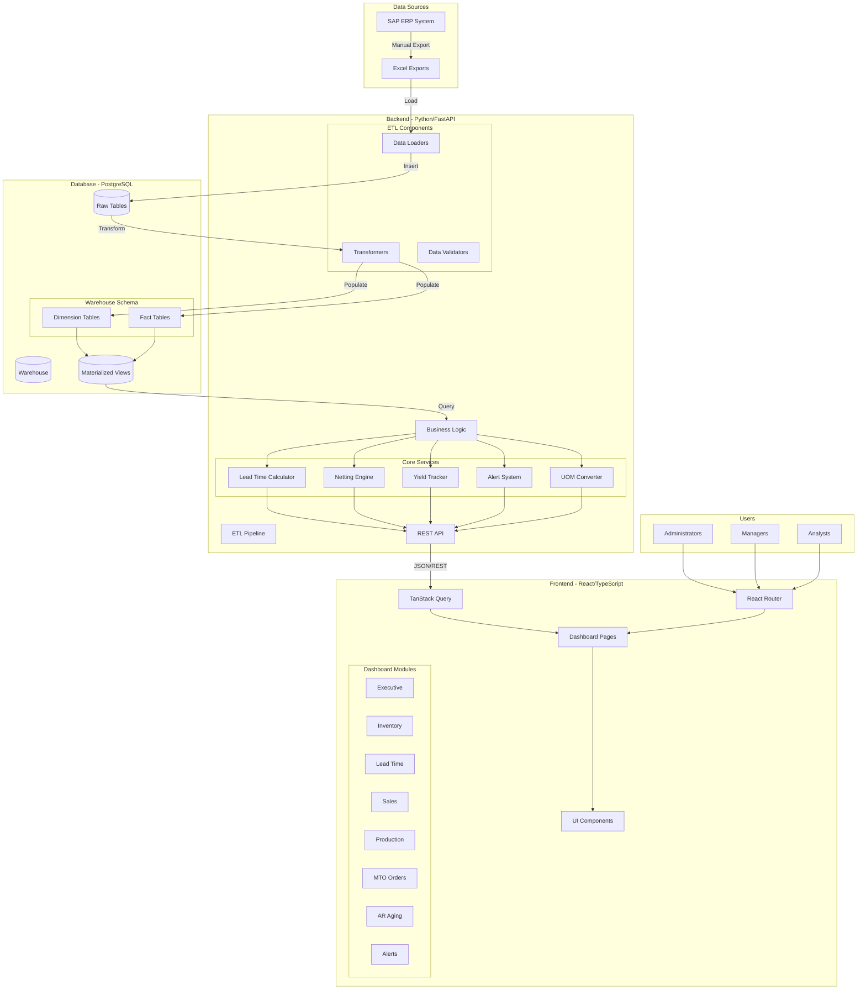
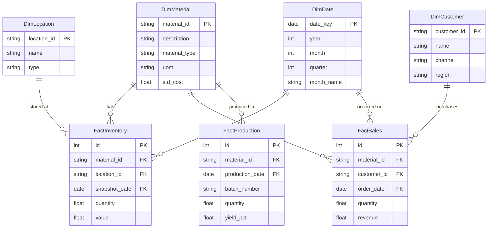
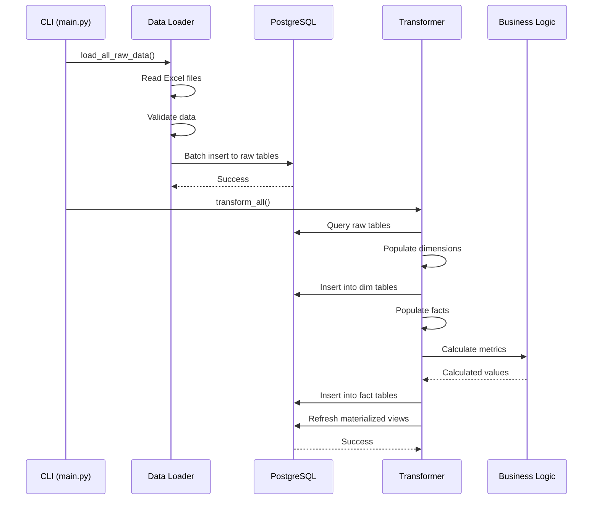
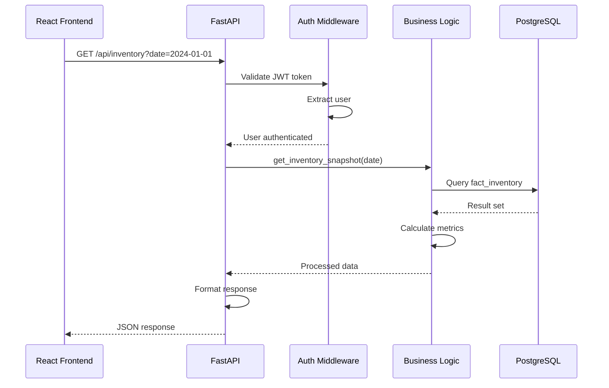
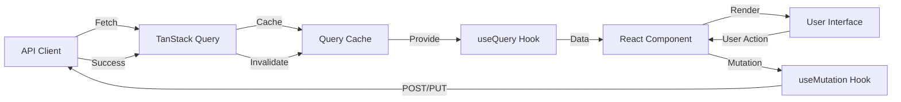
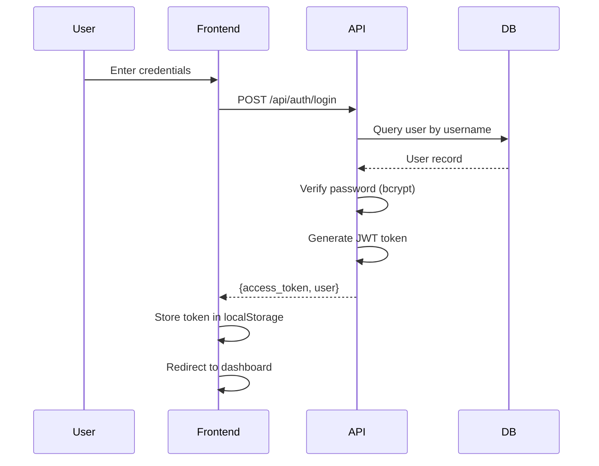
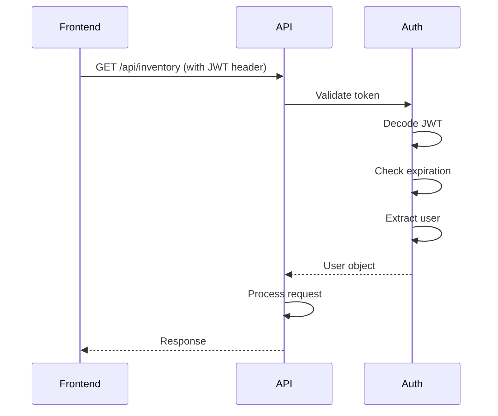
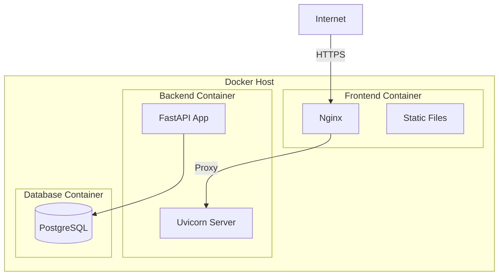

# Alkana Dashboard - System Architecture

**Last Updated:** January 13, 2026 (OTIF + V3 Yield) | **Version:** v1.0+ | **Deployment:** Docker Compose + PostgreSQL

## System Context Diagram

```
┌─────────────────────────────────────────────────────────────────────────┐
│                     SAP ERP System (External)                           │
│                    Manual Excel Exports (Daily)                         │
└─────────────────────────────────────────────────────────────────────────┘
                                     ▼
┌──────────────────────────── ALKANA DASHBOARD ────────────────────────────┐
│                                                                          │
│  ┌────────────────────────────────────────────────────────────────────┐ │
│  │               Frontend (React/TypeScript/Vite)                     │ │
│  │                      Port: 5173 (dev)                              │ │
│  │  ┌──────────────────────────────────────────────────────────────┐ │ │
│  │  │ 8 Dashboard Modules: Executive, Inventory, LeadTime, Sales, │ │ │
│  │  │ Production (V3), MTO, AR Aging, Alerts                       │ │ │
│  │  └──────────────────────────────────────────────────────────────┘ │ │
│  │  ┌──────────────────────────────────────────────────────────────┐ │ │
│  │  │ State: TanStack Query (server cache) + React Hooks (local)   │ │ │
│  │  │ UI: TailwindCSS, Recharts, React Router 7                    │ │ │
│  │  └──────────────────────────────────────────────────────────────┘ │ │
│  └────────────────────────────────────────────────────────────────────┘ │
│                                  ▲▼                                      │
│                      HTTP/REST (JSON over HTTPS)                        │
│                                  ▲▼                                      │
│  ┌────────────────────────────────────────────────────────────────────┐ │
│  │           Backend (Python/FastAPI) Port: 8000                      │ │
│  │  ┌──────────────────────────────────────────────────────────────┐ │ │
│  │  │ API Layer (11 routers):                                     │ │ │
│  │  │ auth, executive, inventory, leadtime, sales, alerts,        │ │ │
│  │  │ yield_v3, mto_orders, ar_aging, upload                      │ │ │
│  │  └──────────────────────────────────────────────────────────────┘ │ │
│  │  ┌──────────────────────────────────────────────────────────────┐ │ │
│  │  │ Business Logic (8 modules):                                 │ │ │
│  │  │ LeadTime, Netting, UOM, Alerts, Business Logic, Upload      │ │ │
│  │  └──────────────────────────────────────────────────────────────┘ │ │
│  │  ┌──────────────────────────────────────────────────────────────┐ │ │
│  │  │ ETL Pipeline:                                               │ │ │
│  │  │ Loaders (8 types) → Transform → Warehouse Population        │ │ │
│  │  │ Dedup via row_hash, Upsert for multi-file, Safe type conv   │ │ │
│  │  └──────────────────────────────────────────────────────────────┘ │ │
│  └────────────────────────────────────────────────────────────────────┘ │
│                                  ▲▼                                      │
│                      SQLAlchemy ORM (async)                             │
│                                  ▲▼                                      │
│  ┌────────────────────────────────────────────────────────────────────┐ │
│  │            Database (PostgreSQL 15+) Port: 5432                    │ │
│  │  ┌──────────────────────────────────────────────────────────────┐ │ │
│  │  │ Raw Layer (8 tables): MB51, ZRSD002, ZRSD004, ZRSD006,      │ │ │
│  │  │ ZRFI005, COOISPI, ZRPP062, COGS                             │ │ │
│  │  └──────────────────────────────────────────────────────────────┘ │ │
│  │  ┌──────────────────────────────────────────────────────────────┐ │ │
│  │  │ Warehouse Layer:                                             │ │ │
│  │  │ - Dimensions (5): Material, Customer, Date, Location, UOM    │ │ │
│  │  │ - Facts (6): Inventory, Sales, Delivery, Production, Alert   │ │ │
│  │  │ - Views (4): Materialized for performance                    │ │ │
│  │  └──────────────────────────────────────────────────────────────┘ │ │
│  │  ┌──────────────────────────────────────────────────────────────┐ │ │
│  │  │ Authentication: Users, Roles (admin|manager|analyst|viewer)  │ │ │
│  │  └──────────────────────────────────────────────────────────────┘ │ │
│  └────────────────────────────────────────────────────────────────────┘ │
│                                                                          │
└──────────────────────────────────────────────────────────────────────────┘
```

## Data Flow Architecture

### 1. Upload Pipeline (User → Dashboard)

```
User selects Excel file
          ▼
Frontend: FormData → POST /api/upload
          ▼
Backend: UploadService.detect_file_type(headers)
  • Reads first row of Excel
  • Pattern matches against known SAP exports
  • Returns: 'MB51' | 'ZRSD002' | 'ZRSD004' | 'ZRSD006' | etc.
          ▼
Get appropriate Loader class (MB51Loader, Zrsd002Loader, etc.)
          ▼
Loader.load(file_path, mode='upsert')
  • get_column_mapping(headers) - Map Excel cols to DB fields
  • Validate data types
  • Calculate row_hash (MD5 of business keys)
  • Check for duplicates (if upsert mode)
  • INSERT OR UPDATE based on business keys
          ▼
Response: { loaded: 396, updated: 2118, skipped: 0, errors: [] }
          ▼
Frontend: Display upload success toast + refresh dashboard
          ▼
(Optional) Trigger transform pipeline if needed
```

### 2. Data Transformation Pipeline (Raw → Warehouse)

```
CLI: python -m src.main transform
          ▼
WarehouseTransformer.transform_all()
          ▼
Transform Inventory:
  raw_mb51 (movements, 11 columns, ~500K rows)
    → GROUP BY material, location, snapshot_date
    → Calculate qty_kg (with UOM conversion via dim_uom)
    → Aggregate movements (101=receipt, 261/601=issue)
    → JOIN with dim_material, dim_location
    → INSERT/UPDATE FactInventory
          ▼
Transform Sales:
  raw_zrsd002 (billing, 19 columns, ~2.1M rows, dedup via row_hash)
    → Upsert mode: Match on (billing_document, billing_item)
    → JOIN dim_customer, dim_material
    → Calculate revenue, COGS, gross margin
    → INSERT/UPDATE FactBilling
          ▼
Transform Delivery (OTIF - NEW Jan 13, 2026):
  raw_zrsd004 (delivery, 27 columns, ~500K rows)
    → Extract planned delivery_date (RDD - Requested Delivery Date)
    → Compare with actual_gi_date (Goods Issue date)
    → Calculate OTIF status:
       * On Time: actual_gi_date ≤ delivery_date
       * Late: actual_gi_date > delivery_date
       * Pending: actual_gi_date IS NULL
    → Include salesman, distribution channel, customer for drill-down
    → INSERT/UPDATE FactDelivery (23 columns)
          ▼
Transform Production:
  raw_cooispi (orders, 14 columns, ~150K rows)
    → Calculate production_time (actual_start → actual_finish)
    → Calculate yield_pct (delivered_qty / order_qty * 100)
    → JOIN with dim_material, dim_date
    → INSERT/UPDATE FactProduction
          ▼
Transform Yield (V3 - NEW Jan 12, 2026):
  raw_zrpp062 (production performance, 27 columns, ~200K rows)
    → Upsert mode: Match on (process_order, batch)
    → Extract output_actual_kg (tonase_alkana_0201)
    → Extract input_actual_kg (gi_sfg_liquid_to_order)
    → Calculate loss_kg and loss_pct
    → Include SG variance (actual vs theoretical)
    → Apply reference_date filter for period aggregation
    → INSERT/UPDATE FactProductionPerformanceV2 (21 columns)
          ▼
Refresh Materialized Views:
  v_inventory_summary (current stock by material/location)
  v_sales_by_channel (revenue aggregated)
  v_lead_time_trend (monthly average lead time)
  v_customer_ar_aging (AR aging buckets)
          ▼
Complete: Warehouse ready for queries (~5-10 min for full transform)
```

### 3. Dashboard Query Pipeline (Warehouse → Frontend)

```
User opens ExecutiveDashboard
          ▼
React mounts → useExecutiveKpis() hook triggered
          ▼
TanStack Query: Check cache (5 min staleness)
  Hit: Return cached data immediately
  Miss: Continue to API
          ▼
Frontend: GET /api/v1/executive/kpis?start_date=&end_date=
          ▼
Backend: executive_router.get_kpis()
  → Query v_sales_by_channel (materialized view)
  → Query v_inventory_summary
  → Query FactProduction + FactDelivery for OTIF
  → Calculate metrics in Python
  → Build response (JSON)
          ▼
Database: Query execution (~200-500ms for complex queries)
  Indexes: date (posting_date, billing_date)
           material (material_id, material_code)
           foreign keys (material_id, customer_id)
          ▼
Response: { revenue: 1234567, otif%: 0.94, inventory_value: 5678901 }
          ▼
Frontend: TanStack Query caches response
          ▼
React renders: Charts, KPI cards, tables
          ▼
User sees dashboard in <2 seconds
```

## Database Schema Architecture

### Layer 1: Raw Tables (Direct SAP Imports)

```sql
-- Material Movements
CREATE TABLE raw_mb51 (
  id SERIAL PRIMARY KEY,
  material_code VARCHAR(40) NOT NULL,
  movement_type VARCHAR(3),    -- 101, 261, 601, 701
  quantity NUMERIC(15,3),
  unit VARCHAR(3),              -- KG, L, EA, PC
  posting_date DATE NOT NULL,
  batch_number VARCHAR(20),
  document_number VARCHAR(20) UNIQUE NOT NULL,
  INDEX idx_posting_date, idx_material_code, idx_batch
);

-- Sales Orders & Billing
CREATE TABLE raw_zrsd002 (
  id SERIAL PRIMARY KEY,
  billing_document VARCHAR(50),
  billing_item INTEGER,
  UNIQUE(billing_document, billing_item),  -- Business key
  customer_name VARCHAR(200),
  material_code VARCHAR(50),
  quantity NUMERIC(18,4),
  net_value NUMERIC(18,4),
  billing_date TIMESTAMP,
  row_hash VARCHAR(32) NOT NULL,           -- Dedup key
  created_at TIMESTAMP NOT NULL,
  INDEX idx_billing_doc, idx_billing_date, idx_row_hash
);

-- Delivery Data (OTIF)
CREATE TABLE raw_zrsd004 (
  id SERIAL PRIMARY KEY,
  delivery_number VARCHAR(50) NOT NULL,
  delivery_date DATETIME,                  -- Planned delivery
  material_code VARCHAR(50),
  quantity NUMERIC(18,4),
  INDEX idx_delivery_date, idx_delivery_number
);

-- Customer Master
CREATE TABLE raw_zrsd006 (
  id SERIAL PRIMARY KEY,
  material_code VARCHAR(50),
  customer_code VARCHAR(50),
  sales_channel VARCHAR(20),
  ph1, ph2, ph3, ph4, ph5, ph6, ph7 VARCHAR(100),  -- Product hierarchy
  INDEX idx_material, idx_customer
);

-- Accounts Receivable
CREATE TABLE raw_zrfi005 (
  id SERIAL PRIMARY KEY,
  customer_code VARCHAR(50),
  ar_amount NUMERIC(18,2),
  due_date DATE,
  snapshot_date DATE,                      -- For period snapshots
  INDEX idx_snapshot_date, idx_customer_code
);

-- Production Orders
CREATE TABLE raw_cooispi (
  id SERIAL PRIMARY KEY,
  order_number VARCHAR(50) UNIQUE NOT NULL,
  material_code VARCHAR(50),
  batch_number VARCHAR(20),
  status VARCHAR(20),
  posting_date TIMESTAMP,
  INDEX idx_posting_date, idx_material_code
);

-- Production Performance (Yield V3)
CREATE TABLE raw_zrpp062 (
  id SERIAL PRIMARY KEY,
  process_order_id VARCHAR(50),
  batch_id VARCHAR(20),
  posting_date DATE,
  UNIQUE(process_order_id, batch_id, posting_date),
  expected_qty NUMERIC(15,3),
  actual_qty NUMERIC(15,3),
  variance_pct NUMERIC(10,2),               -- Calculated
  created_at TIMESTAMP NOT NULL,
  INDEX idx_posting_date, idx_batch_id
);

-- Cost of Goods Sold
CREATE TABLE raw_cogs (
  id SERIAL PRIMARY KEY,
  material_code VARCHAR(50),
  period DATE,
  cogs_amount NUMERIC(18,2),
  INDEX idx_period, idx_material_code
);
```

### Layer 2: Dimension Tables (Reference Data)

```sql
CREATE TABLE dim_material (
  material_id VARCHAR(50) PRIMARY KEY,
  description VARCHAR(200),
  material_type VARCHAR(20),        -- FG (finished), RM (raw), SM (semi)
  category VARCHAR(50),
  default_uom VARCHAR(3),           -- KG, L, EA
  active BOOLEAN DEFAULT true,
  created_at TIMESTAMP NOT NULL,
  INDEX idx_active
);

CREATE TABLE dim_customer (
  customer_id VARCHAR(50) PRIMARY KEY,
  name VARCHAR(200),
  sales_channel VARCHAR(20),
  region VARCHAR(50),
  credit_limit NUMERIC(18,2),
  active BOOLEAN DEFAULT true,
  created_at TIMESTAMP NOT NULL
);

CREATE TABLE dim_date (
  date_key DATE PRIMARY KEY,
  calendar_year INTEGER,
  calendar_month INTEGER,           -- 1-12
  calendar_quarter INTEGER,         -- 1-4
  calendar_week INTEGER,
  day_of_month INTEGER,             -- 1-31
  day_of_week VARCHAR(10),          -- Monday-Sunday
  is_weekend BOOLEAN,
  is_holiday BOOLEAN
);

CREATE TABLE dim_location (
  location_id VARCHAR(20) PRIMARY KEY,
  location_name VARCHAR(100),
  location_type VARCHAR(20),        -- Plant, SLOC, Warehouse
  parent_location_id VARCHAR(20),   -- For hierarchies
  capacity NUMERIC(15,3),
  active BOOLEAN DEFAULT true
);

CREATE TABLE dim_uom_conversion (
  id SERIAL PRIMARY KEY,
  material_id VARCHAR(50) REFERENCES dim_material,
  uom_from VARCHAR(3),
  uom_to VARCHAR(3),                -- Always standardized to KG or L
  kg_per_unit NUMERIC(15,6),        -- Conversion factor
  variance_pct NUMERIC(10,2),       -- Accuracy metric
  UNIQUE(material_id, uom_from, uom_to)
);
```

### Layer 3: Fact Tables (Business Events)

```sql
CREATE TABLE fact_inventory (
  id SERIAL PRIMARY KEY,
  material_id VARCHAR(50) REFERENCES dim_material,
  location_id VARCHAR(20) REFERENCES dim_location,
  snapshot_date DATE REFERENCES dim_date,
  qty_kg NUMERIC(15,3),             -- Converted to standard UOM
  qty_liters NUMERIC(15,3),         -- If applicable
  qty_pieces INTEGER,
  net_value NUMERIC(18,2),          -- Stock valuation
  created_at TIMESTAMP NOT NULL,
  updated_at TIMESTAMP NOT NULL,
  UNIQUE(material_id, location_id, snapshot_date),
  INDEX idx_material_location_date
);

CREATE TABLE fact_sales (
  id SERIAL PRIMARY KEY,
  material_id VARCHAR(50) REFERENCES dim_material,
  customer_id VARCHAR(50) REFERENCES dim_customer,
  order_date DATE REFERENCES dim_date,
  billing_date DATE REFERENCES dim_date,
  quantity NUMERIC(18,4),
  net_value NUMERIC(18,4),
  revenue NUMERIC(18,4),
  margin_pct NUMERIC(10,2),
  created_at TIMESTAMP NOT NULL,
  INDEX idx_billing_date, idx_material_customer_date
);

CREATE TABLE fact_delivery (
  id SERIAL PRIMARY KEY,
  delivery_number VARCHAR(50) UNIQUE,
  so_reference VARCHAR(50),         -- Link to sales order
  material_id VARCHAR(50) REFERENCES dim_material,
  planned_delivery_date DATE REFERENCES dim_date,
  planned_delivery_date_value DATE,  -- Raw date for OTIF calc
  actual_gi_date DATE REFERENCES dim_date,  -- When goods issued
  actual_gi_date_value DATE,         -- Raw date for OTIF calc
  quantity NUMERIC(18,4),
  otif_status VARCHAR(20),          -- 'On Time' | 'Late' | 'Pending'
  created_at TIMESTAMP NOT NULL,
  updated_at TIMESTAMP NOT NULL,
  INDEX idx_delivery_date, idx_actual_gi_date, idx_otif_status
);

CREATE TABLE fact_production (
  id SERIAL PRIMARY KEY,
  order_number VARCHAR(50),
  material_id VARCHAR(50) REFERENCES dim_material,
  batch_number VARCHAR(20),
  po_create_date DATE REFERENCES dim_date,
  gr_date DATE REFERENCES dim_date,
  gi_date DATE REFERENCES dim_date,
  production_days INTEGER,          -- Calculated
  transit_days INTEGER,             -- Calculated
  total_days INTEGER,               -- Calculated
  quantity NUMERIC(18,4),
  status VARCHAR(20),               -- Completed, Pending, Cancelled
  created_at TIMESTAMP NOT NULL,
  INDEX idx_production_date, idx_material_id
);

CREATE TABLE fact_production_performance_v2 (
  id SERIAL PRIMARY KEY,
  process_order_id VARCHAR(50),
  batch_id VARCHAR(20),
  posting_date DATE REFERENCES dim_date,
  UNIQUE(process_order_id, batch_id, posting_date),
  expected_qty NUMERIC(15,3),
  actual_qty NUMERIC(15,3),
  loss_kg NUMERIC(15,3),           -- expected_qty - actual_qty
  loss_percentage NUMERIC(10,2),   -- (loss_kg / expected_qty) * 100
  variance_pct NUMERIC(10,2),      -- User-defined variance metric
  reference_date DATE,             -- For filtering
  created_at TIMESTAMP NOT NULL,
  updated_at TIMESTAMP NOT NULL,
  INDEX idx_posting_date, idx_loss_percentage, idx_variance_pct
);

CREATE TABLE fact_alert (
  id SERIAL PRIMARY KEY,
  alert_type VARCHAR(20),          -- 'inventory' | 'production' | 'financial'
  severity VARCHAR(10),            -- 'critical' | 'warning' | 'info'
  entity_type VARCHAR(20),         -- 'material' | 'order' | 'customer'
  entity_id VARCHAR(50),
  description TEXT,
  resolution_notes TEXT,
  status VARCHAR(20),              -- 'open' | 'in_progress' | 'resolved'
  created_at TIMESTAMP NOT NULL,
  updated_at TIMESTAMP NOT NULL,
  INDEX idx_severity, idx_created_date
);
```

### Layer 4: Materialized Views (Performance)

```sql
-- Pre-aggregated inventory summary
CREATE MATERIALIZED VIEW v_inventory_summary AS
SELECT
  m.material_id,
  m.description,
  l.location_id,
  SUM(fi.qty_kg) as total_qty_kg,
  SUM(fi.net_value) as total_value,
  MAX(fi.snapshot_date) as last_update
FROM fact_inventory fi
  JOIN dim_material m ON fi.material_id = m.material_id
  JOIN dim_location l ON fi.location_id = l.location_id
GROUP BY m.material_id, l.location_id
WITH INDEX idx_summary_material;

-- Revenue by sales channel
CREATE MATERIALIZED VIEW v_sales_by_channel AS
SELECT
  c.sales_channel,
  DATE_TRUNC('month', fs.billing_date) as period,
  SUM(fs.revenue) as revenue,
  SUM(fs.quantity) as volume
FROM fact_sales fs
  JOIN dim_customer c ON fs.customer_id = c.customer_id
GROUP BY c.sales_channel, DATE_TRUNC('month', fs.billing_date);

-- Lead time trends (monthly)
CREATE MATERIALIZED VIEW v_lead_time_trend AS
SELECT
  DATE_TRUNC('month', fp.gr_date) as period,
  AVG(fp.production_days) as avg_production_days,
  AVG(fp.transit_days) as avg_transit_days,
  AVG(fp.total_days) as avg_total_days
FROM fact_production fp
GROUP BY DATE_TRUNC('month', fp.gr_date);

-- Customer AR aging
CREATE MATERIALIZED VIEW v_customer_ar_aging AS
SELECT
  c.customer_id,
  c.name,
  CASE
    WHEN EXTRACT(DAY FROM NOW() - fr.due_date) <= 30 THEN '0-30'
    WHEN EXTRACT(DAY FROM NOW() - fr.due_date) <= 60 THEN '31-60'
    WHEN EXTRACT(DAY FROM NOW() - fr.due_date) <= 90 THEN '61-90'
    ELSE '90+'
  END as aging_bucket,
  SUM(fr.ar_amount) as bucket_amount
FROM fact_ar fr
  JOIN dim_customer c ON fr.customer_id = c.customer_id
GROUP BY c.customer_id, aging_bucket;
```

## API Architecture

### Complete Endpoint Organization (11 Routers, 240+ Endpoints)

```
/api/v1/
├── /auth/ (4 endpoints)
│   ├── POST /login              → { token, user_id, role, expires_in }
│   ├── POST /logout             → 200 OK
│   ├── GET /me                  → Current user profile (JWT required)
│   └── POST /refresh            → Refresh JWT token
│
├── /dashboards/executive/ (3 endpoints)
│   ├── GET /kpis               → { revenue, otif%, inventory_value, ar_aging }
│   ├── GET /trends             → Monthly trends (12 months)
│   └── GET /comparisons        → YoY comparisons
│
├── /inventory/ (4 endpoints)
│   ├── GET /levels             → Current stock by material/location
│   ├── GET /movements          → Material movement history (filterable)
│   ├── GET /alerts             → Low stock, expiring, slow-moving
│   └── GET /snapshots          → Inventory by date (historical)
│
├── /lead-time/ (6 endpoints)
│   ├── GET /analytics          → Production + transit breakdown
│   ├── GET /summary            → Average by product/customer
│   ├── GET /recent-orders      → 50 latest deliveries with OTIF ⭐ JAN 13
│   ├── GET /otif-summary       → On-time %, Late %, Pending %
│   ├── GET /by-salesman        → Lead time by sales team
│   └── GET /forecast           → Predicted vs actual (ML-ready)
│
├── /sales-performance/ (5 endpoints)
│   ├── GET /revenue            → By channel/customer/product
│   ├── GET /trends             → Monthly growth rates
│   ├── GET /by-dimension       → Multi-dimensional drill-down
│   ├── GET /top-customers      → Top 20 by revenue
│   └── GET /margins            → Gross margin analysis
│
├── /yield/v3/ (4 endpoints)
│   ├── GET /variance           → Loss % analysis with filters
│   ├── GET /summary            → Batch-level metrics
│   ├── GET /trends             → Historical yield trends
│   └── GET /loss-analysis      → Root cause analysis (SG, process, etc)
│
├── /mto-orders/ (3 endpoints)
│   ├── GET /orders             → Custom order status & tracking
│   ├── GET /compliance         → Lead time adherence vs SLA
│   └── GET /forecast           → Predicted completion dates
│
├── /ar-aging/ (3 endpoints)
│   ├── GET /buckets            → 0-30, 31-60, 61-90, 90+ days aging
│   ├── GET /details            → Customer-level breakdown
│   └── GET /aging-trend        → Monthly AR aging progression
│
├── /alerts/ (4 endpoints)
│   ├── GET /active             → Current open alerts (severity filtered)
│   ├── GET /history            → Historical alerts with resolution
│   ├── POST /resolve           → Close/acknowledge alert
│   └── POST /snooze            → Temporarily hide alert
│
└── /upload/ (4 endpoints)
    ├── POST /files             → Upload Excel (multipart/form-data)
    ├── GET /detection          → Auto-detect file type from headers
    ├── GET /history            → Upload audit trail (file, count, date)
    └── POST /validate          → Dry-run validation before upload
```

**Key API Characteristics:**
- **Response Times**: < 500ms p95 (materialized views + indexes)
- **Authentication**: JWT Bearer tokens (24h expiration, refresh endpoint)
- **Rate Limiting**: 1000 req/min per user (planned)
- **Pagination**: Default 50 rows, max 500 (offset-based)
- **Filtering**: Query params (material_code, customer_id, date_range, status)

### OTIF (On-Time In-Full) Delivery Flow (Jan 13, 2026)

**Calculation Logic:**
```sql
-- OTIF Status Determination
CASE 
  WHEN actual_gi_date IS NULL THEN 'Pending'
  WHEN actual_gi_date <= delivery_date THEN 'On Time'
  ELSE 'Late'
END as otif_status

-- Example:
-- delivery_date (RDD): 2026-01-15 10:00
-- actual_gi_date (GI): 2026-01-14 16:30
-- OTIF Status: On Time ✓

-- delivery_date (RDD): 2026-01-15 10:00
-- actual_gi_date (GI): 2026-01-17 09:00
-- OTIF Status: Late ✗
```

**Data Sources:**
- `raw_zrsd004`: Delivery documents (27 columns) - Updated Jan 13, 2026
  - `delivery_date`: Planned RDD (Requested Delivery Date)
  - `actual_gi_date`: Actual goods issue date
  - `salesman_name`, `dist_channel`, `customer`: For KPI segmentation
  
- `fact_delivery`: OTIF fact table (23 columns)
  - Derived columns: `otif_status` (calculated)
  - Indexes on `delivery_date`, `actual_gi_date` for fast queries

**Query Pattern for Dashboard:**
```python
# Lead Time Dashboard: recent-orders endpoint
SELECT 
    delivery,
    so_reference,
    delivery_date,
    actual_gi_date,
    CASE 
        WHEN actual_gi_date IS NULL THEN 'Pending'
        WHEN actual_gi_date <= delivery_date THEN 'On Time'
        ELSE 'Late'
    END as otif_status,
    salesman_name,
    ship_to_name,
    material_description,
    delivery_qty_kg
FROM fact_delivery
WHERE delivery_date >= CURRENT_DATE - INTERVAL '30 days'
ORDER BY delivery_date DESC
LIMIT 50;
```

---

### Response Structure

```typescript
// Success Response
{
  "success": true,
  "data": { /* domain object */ },
  "timestamp": "2026-01-13T10:30:00Z"
}

// Error Response
{
  "success": false,
  "error": "Business key violation",
  "error_code": "DUPLICATE_KEY",
  "details": {
    "field": "billing_document",
    "message": "Record already exists"
  }
}

// List Response
{
  "success": true,
  "data": [ /* array of objects */ ],
  "pagination": {
    "total": 1234,
    "page": 1,
    "per_page": 50,
    "pages": 25
  }
}
```

### V3 Yield Efficiency Hub (Jan 12, 2026)

**Features:**
- Production loss analysis by process order and batch
- Specific gravity (SG) variance tracking (actual vs theoretical)
- Monthly aggregation with reference_date for period reporting
- Upsert mode: Updates existing records if process_order + batch match

**Data Sources:**
- `raw_zrpp062`: Production performance (27 columns) - Jan 8, 2026 addition
  - `tonase_alkana_0201`: Actual output (KG)
  - `gi_sfg_liquid_to_order`: Actual input (KG)
  - `sg_theoretical`, `sg_actual`: Specific gravity metrics
  - `variant_prod_sfg_pct`, `variant_fg_pct`: Variant production metrics

- `fact_production_performance_v2`: V3 yield fact (21 columns)
  - Calculated: `loss_kg = input - output`
  - Calculated: `loss_pct = (loss_kg / input) * 100`
  - `reference_date`: Monthly aggregation key (1st of month)
  - **Deprecated Tables Dropped Jan 12, 2026:**
    - ~~`fact_production_chain`~~ (replaced by V3)
    - ~~`fact_p02_p01_yield`~~ (consolidated into V3)

**Query Pattern for Dashboard:**
```python
# Yield V3 Dashboard: variance endpoint
SELECT 
    batch_id,
    process_order_id,
    material_code,
    output_actual_kg,
    input_actual_kg,
    loss_kg,
    loss_pct,
    sg_theoretical,
    sg_actual,
    (sg_actual - sg_theoretical) as sg_variance,
    reference_date
FROM fact_production_performance_v2
WHERE reference_date >= CURRENT_DATE - INTERVAL '3 months'
ORDER BY loss_pct DESC
LIMIT 100;
```

---

## Performance Architecture

### Database Optimization

**Indexing Strategy**
- Primary indexes: `date` fields (posting_date, billing_date, snapshot_date)
- Secondary indexes: `material_id`, `customer_id`, `document_number`
- Composite indexes: (material_id, location_id, snapshot_date)
- Foreign key indexes: Auto-created by PostgreSQL

**Query Optimization**
- Materialized views for common aggregations (<500ms response)
- Connection pooling (20 connections default)
- Async queries avoid blocking (FastAPI)
- Query timeouts (30s default)

### Caching Strategy

| Layer | Cache | TTL | Trigger |
|-------|-------|-----|---------|
| Frontend | TanStack Query | 5 min | Manual invalidation |
| API | Response headers | 60 sec | Conditional ETags |
| Database | PostgreSQL buffer | Dynamic | Memory-based |

### Monitoring & Metrics

```
Dashboard Load Time: Target <2s
├── API Response: <500ms p95 (Exec: 300-400ms, Inventory: 200-300ms)
├── Network Transfer: <200ms
├── React Render: <800ms
└── Chart Rendering: <500ms

Database Query Time: Target <200ms
├── Materialized views (inventory, sales): <100ms p95
├── Indexed fact queries (delivery, production): <150ms p95
├── Complex joins (multi-table): <300ms p95
├── Full table scans: >5s (avoided via indexes)

OTIF (Jan 13, 2026) - New Metrics:
├── Delivery on-time %: Aggregated from fact_delivery
├── Query perf: <300ms for 30-day summary
├── Recent orders (50 limit): <500ms p95

V3 Yield (Jan 12, 2026) - New Metrics:
├── Loss % calculation: <200ms per batch
├── Variance trending: <400ms for 3-month view
└── SG analysis: <350ms for product drill-down
```

## Security Architecture

### Authentication Flow

```
User enters email/password
         ▼
POST /auth/login { email, password }
         ▼
Backend: Verify email exists
         ▼
Backend: Hash password, compare with stored hash (bcrypt)
         ▼
Success: Generate JWT { user_id, role, exp: +24h }
         ▼
Response: { token, user: { id, email, role } }
         ▼
Frontend: Store token in localStorage (client-side only)
         ▼
Subsequent requests: Include Authorization: Bearer <token>
         ▼
Backend Middleware: Verify JWT signature, extract user_id/role
         ▼
Allow/Deny request based on role permissions
```

### Data Security

- **Secrets**: Stored in `.env` (never in git)
- **Database**: PostgreSQL user with minimal permissions
- **API Keys**: Not exposed in frontend code
- **CORS**: Restricted to frontend origin
- **HTTPS**: Required in production (via reverse proxy)

## Deployment Architecture

### Development Stack

```
Docker Compose (docker-compose.yml):
├── backend (FastAPI):
│   Port: 8000
│   Volume: ./src → /app/src (hot-reload)
│   Env: DATABASE_URL, SECRET_KEY
│
├── frontend (Vite):
│   Port: 5173
│   Volume: ./web → /app/web (hot-reload)
│   Env: VITE_API_URL=http://localhost:8000
│
└── postgres (PostgreSQL 15):
    Port: 5432
    Volume: postgres_data → /var/lib/postgresql/data
    Env: POSTGRES_PASSWORD, POSTGRES_DB
```

### Production Considerations

- Load balancer (NGINX) in front of FastAPI instances
- Database read replicas for scaling queries
- Redis cache for session/token storage
- S3/Cloud storage for file uploads
- CDN for static assets
- Structured logging (ELK stack)
- Monitoring (Prometheus + Grafana)



## Architecture Layers

### 1. Data Layer

#### Data Sources
- **SAP ERP**: Source of truth for all business data
- **Excel Exports**: Manual exports from SAP (MB51, ZRSD002, ZRSD006, etc.)
- **File Storage**: `demodata/` directory for Excel files

#### Database Schema

**Raw Layer**
- Direct imports from Excel files
- Minimal transformation
- Preserves original data structure
- Tables: `raw_mb51`, `raw_zrsd002`, `raw_zrsd006`, etc.

**Warehouse Layer**
- **Dimension Tables**: Master data (materials, customers, dates, locations)
- **Fact Tables**: Transactional data (inventory, sales, production, movements)
- **Materialized Views**: Pre-aggregated metrics for performance



### 2. ETL Pipeline

#### Extract
- Read Excel files using Pandas/Polars
- Validate file structure and required columns
- Handle encoding issues (UTF-8, Latin-1)

#### Load
- **Upsert Mode**: For business-critical files (ZRSD002, ZRFI005)
  - Business keys: `(billing_document, billing_item)` for ZRSD002
  - `row_hash`: MD5 of raw_data (excludes `source_file` for cross-file dedup)
  - Upsert logic: Update if business key exists, insert if new, skip if hash identical
- **Insert Mode**: Batch insert for historical imports
- Transaction management for data integrity
- Error logging and rollback on failure
- Auto file-type detection via header patterns

#### Transform
- **Dimension Population**: Extract unique values from raw data
- **Fact Population**: Join raw data with dimensions
- **Data Cleansing**: Handle nulls, duplicates, data type conversions
- **Business Rules**: Apply domain-specific transformations



### 3. Business Logic Layer

#### Core Services

**Lead Time Calculator** (`leadtime_calculator.py`)
- Tracks material flow from P02 (finished goods) to P01 (raw materials)
- Calculates production time, transit time, and total lead time
- Identifies bottlenecks in the supply chain

**Netting Engine** (`netting.py`)
- Reconciles material movements (goods receipts vs. issues)
- Calculates net inventory changes
- Validates stock balances

**Yield Tracker** (`yield_tracker.py`)
- Tracks production yield at batch level
- Links P02 batches to P01 inputs
- Calculates material consumption and waste

**Alert System** (`alerts.py`)
- Monitors inventory thresholds
- Detects production delays
- Flags quality issues
- Identifies financial exceptions

**UOM Converter** (`uom_converter.py`)
- Converts between units of measure (KG, L, EA, etc.)
- Maintains conversion factors
- Standardizes metrics for analytics

#### Frontend Utilities

**Date Range Helpers** (`web/src/utils/dateHelpers.ts`)
- Timezone-safe date formatting using local date components
- Default range: First day of current month → Today
- Functions: `getFirstDayOfMonth()`, `getToday()`, `getDefaultDateRange()`
- Prevents Dec 31 bug caused by UTC midnight offset

**DateRangePicker Component** (`web/src/components/common/DateRangePicker.tsx`)
- Shared date filter UI across all dashboards
- Syncs local state with props via `useEffect`
- Reset button uses local-date strings, not `toISOString()`

### 4. API Layer

#### FastAPI Application

**Endpoints**
- `/api/auth/*`: Authentication (login, logout, token refresh)
- `/api/executive/*`: Executive dashboard KPIs
- `/api/inventory/*`: Inventory levels and movements
- `/api/lead-time/*`: Lead time analytics
- `/api/sales/*`: Sales performance metrics
- `/api/yield/*`: Production yield data
- `/api/mto-orders/*`: Make-to-order tracking
- `/api/ar-aging/*`: Accounts receivable aging
- `/api/alerts/*`: Alert monitoring

**Middleware**
- CORS: Allow frontend origin
- Authentication: JWT token validation
- Error Handling: Global exception handler
- Logging: Request/response logging

**Dependencies**
- Database session injection
- Current user extraction from JWT
- Role-based access control



### 5. Frontend Layer

#### React Application Architecture

**Routing**
- React Router for client-side navigation
- Protected routes requiring authentication
- Lazy loading for code splitting

**State Management**
- **Server State**: TanStack Query (caching, refetching, optimistic updates)
- **Local State**: React hooks (`useState`, `useReducer`)
- **Auth State**: Context API for user session

**Component Hierarchy**
```
App
├── Router
│   ├── Login (public)
│   └── DashboardLayout (protected)
│       ├── Navigation
│       ├── ExecutiveDashboard
│       ├── Inventory
│       ├── LeadTimeDashboard
│       ├── SalesPerformance
│       ├── ProductionYield
│       ├── MTOOrders
│       ├── ArAging
│       └── AlertMonitor
```

**Data Flow**


### 6. Authentication & Authorization

#### JWT-Based Authentication

**Login Flow**


**Protected Request Flow**


#### Role-Based Access Control (RBAC)
- **Admin**: Full access (CRUD on all resources)
- **Manager**: Read access to all dashboards, limited data export
- **Analyst**: Access to specific modules based on department
- **Viewer**: Read-only access to executive dashboard

### 7. Deployment Architecture

#### Development Environment
```
Developer Machine
├── Backend (localhost:8000)
│   └── Python/FastAPI
├── Frontend (localhost:5173)
│   └── Vite Dev Server
└── Database (localhost:5432)
    └── PostgreSQL
```

#### Production Environment (Docker)


**Docker Compose Services**
- `backend`: Python/FastAPI application
- `frontend`: Nginx serving React build
- `db`: PostgreSQL database

### 8. Performance Optimizations

#### Database
- **Indexes**: On frequently queried columns (material_id, customer_id, date)
- **Materialized Views**: Pre-aggregated metrics refreshed periodically
- **Connection Pooling**: Reuse database connections
- **Query Optimization**: Avoid N+1 queries, use joins efficiently

#### Backend
- **Caching**: Redis for frequently accessed data (planned)
- **Batch Processing**: Bulk inserts for large datasets
- **Async I/O**: FastAPI async endpoints for I/O-bound operations
- **Pagination**: Limit result sets to prevent memory issues

#### Frontend
- **Code Splitting**: Lazy load routes and components
- **Memoization**: React.memo, useMemo, useCallback
- **Query Caching**: TanStack Query caches API responses
- **Virtual Scrolling**: For large data tables (planned)

### 9. Security Considerations

#### Backend
- **Input Validation**: Pydantic models for request validation
- **SQL Injection Prevention**: SQLAlchemy ORM (parameterized queries)
- **Password Hashing**: bcrypt with salt
- **JWT Expiration**: Tokens expire after 24 hours
- **CORS**: Restrict allowed origins

#### Frontend
- **XSS Prevention**: React escapes output by default
- **CSRF Protection**: SameSite cookies (planned)
- **Secure Storage**: Avoid storing sensitive data in localStorage
- **HTTPS Only**: Enforce HTTPS in production

### 10. Monitoring & Logging

#### Backend Logging
- Request/response logging
- Error tracking with stack traces
- Performance metrics (query execution time)
- ETL pipeline logs

#### Frontend Logging
- Error boundaries for React errors
- API error logging
- User action tracking (planned)

## Technology Stack Summary

| Layer | Technology | Purpose |
|-------|-----------|---------|
| **Frontend** | React 19 | UI library |
| | TypeScript | Type safety |
| | Vite | Build tool |
| | TailwindCSS 4 | Styling |
| | Recharts | Data visualization |
| | TanStack Query | Server state management |
| | React Router 7 | Client-side routing |
| **Backend** | Python 3.11+ | Core language |
| | FastAPI | Web framework |
| | SQLAlchemy 2.0 | ORM |
| | Pandas | Data processing |
| | Polars | High-performance data processing |
| | Pydantic | Data validation |
| | Uvicorn | ASGI server |
| **Database** | PostgreSQL 15+ | Relational database |
| **Deployment** | Docker | Containerization |
| | Docker Compose | Orchestration |
| **Auth** | JWT | Token-based authentication |
| | bcrypt | Password hashing |

## Scalability Considerations

### Current Capacity
- **Data Volume**: 100K+ rows per data source
- **Concurrent Users**: 100+ users
- **Response Time**: < 500ms for 95th percentile

### Future Scaling Strategies
- **Horizontal Scaling**: Multiple backend instances behind load balancer
- **Database Replication**: Read replicas for analytics queries
- **Caching Layer**: Redis for frequently accessed data
- **CDN**: Serve static frontend assets from CDN
- **Microservices**: Split monolithic backend into domain services
